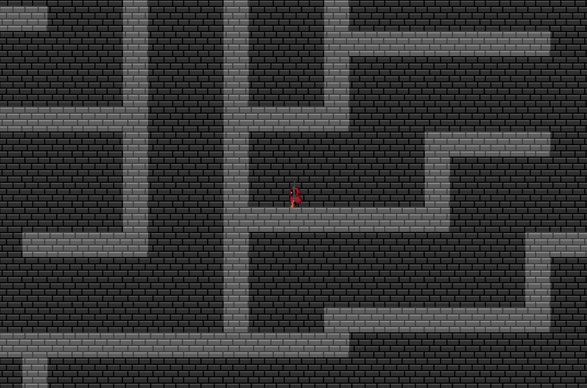
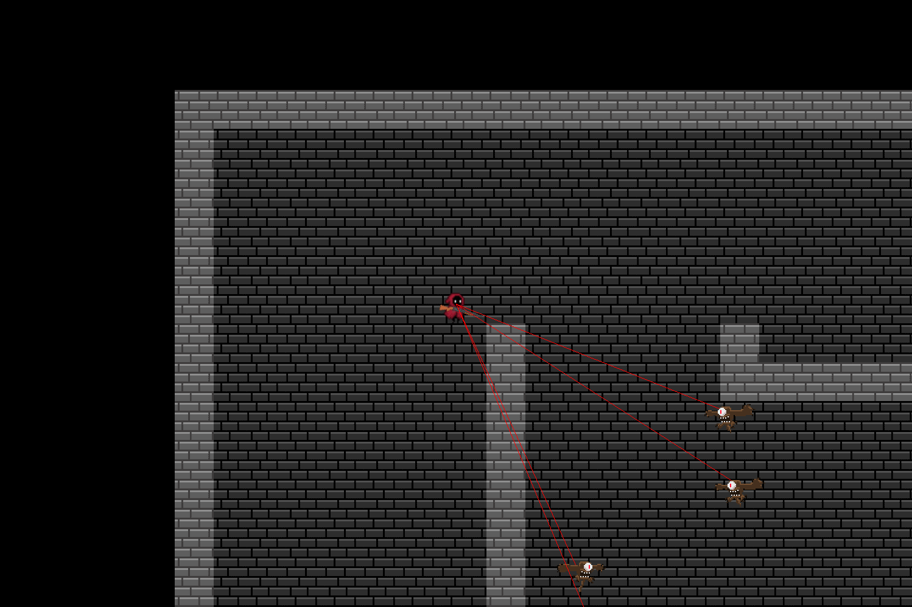
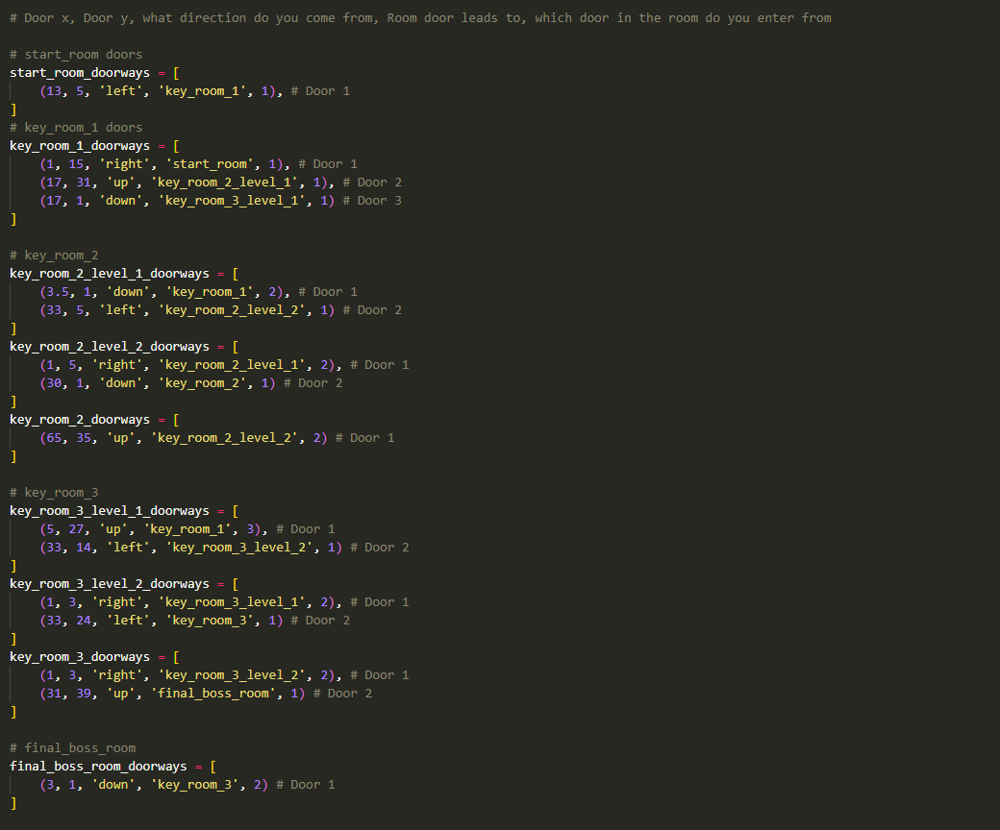
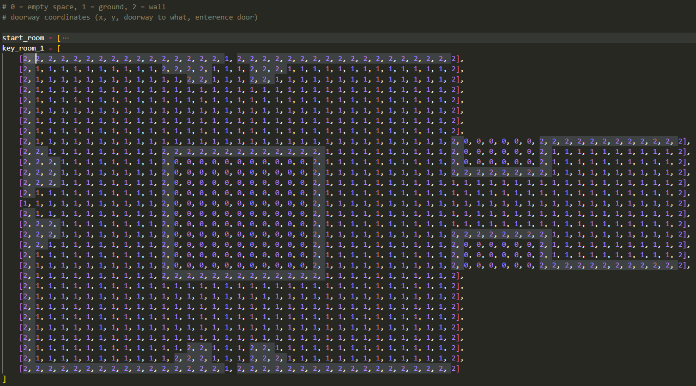

# Python Dungeon Escape

An entirely object-oriented dungeon crawler game, free-to-play online, where the player must fight through a series of levels to escape. Along the way, players encounter a variety of enemies, bosses, and obstacles. Armed with a gun, the player must defeat everything in their path in order to survive and escape.

**Link to Project:** https://dogegraveth.itch.io/crypt-of-chaos

## How It's Made:
**Tech used: Python, Pygame**
This game was made using Python's Pygame library. The game features:
- Enemy AI that follows the player when given a unbroken line of sight and attacks the player when in range
  
- An boss class that inherits from the enemy class with more advanced features like more attacks
- A door system that uses instructions given by arrays specifying door location, door target, door direction and matches them with their respective maps. When player collides with a door, they are taken to the door's target
  
- Generated maps based off of matrices matched with a block pattern that is replicated for the entire map
  
- A gun that shoots whenever the user right clicks triggering a cooldown and a recoil to the player. The gun rotates every frame to face the mouse.

This game was loads of fun to make and came with a swarm of challenges which I had to overcome. By the end of it, it totaled to over 800+ lines of code in just my main.py file! I feel as though I really pushed the limits of a simple game engine like pygame with this project, to the point the old chestnut began struggling to run it.
